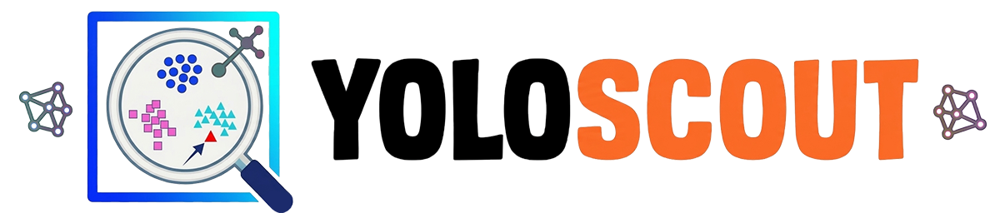

# 🔍 YoloScout — YOLO Dataset quality analysis tool

<div align="center">
  <picture>
    <source media="(prefers-color-scheme: dark)" srcset="images/yolo-scout-white.png">
    <source media="(prefers-color-scheme: light)" srcset="images/yolo-scout-black.png">
    
  </picture>

**A comprehensive tool for analyzing and visualizing YOLO dataset quality using a custom FiftyOne wrapper**

[](https://pypi.org/project/yolo-scout/)
[](https://www.python.org/)
[](https://voxel51.com/fiftyone)
[](LICENSE)
</div>

---

<div align="center">
  
</div>

## 🚀 Quick Start

### Installation

```bash
# Install the package from PyPI
pip install yolo-scout
```

### Basic Usage

```bash
# Option 1: Command-line only (no config file)
yolo-scout data=/path/to/dataset task=detect

# Option 2: Config file only (more details below)
yolo-scout config=my_config.yaml

# Option 3: Config file + overrides
yolo-scout config=default.yaml batch=8

# Option 4: Force reload of an existing dataset
yolo-scout data=/path/to/dataset task=detect reload=True
```

If you want to use the configuration file option, you can create a config file (e.g., `my_config.yaml`) with the
following structure (all keys are optional and override the defaults):

```yaml
data: "/path/to/your/dataset"
task: "detect"  # detect, segment, classify, pose, obb
name: "my_dataset"  # auto-generated from path if not set
reload: false

skip_embeddings: false
model: "openai_clip"
batch: 16
mask_background: true

thumbnail_dir: "yolo_scout/thumbnails"
thumbnail_width: 800

skip_quality: false

port: 5151
skip_launch: false
```

### Command-Line Arguments

| Argument        | Type   | Default                   | Description                                                                                                                                                              |
|-----------------|--------|---------------------------|--------------------------------------------------------------------------------------------------------------------------------------------------------------------------|
| `config`        | `str`  | `None`                    | Path to config YAML file. Overrides default settings.                                                                                                                    |
| `data`          | `str`  | `None`                    | Path to your dataset. Required unless provided in config file and must follow the [YOLO format](https://docs.ultralytics.com/datasets/).                                 |
| `task`          | `str`  | `'detect'`                | Task type: `classify`, `detect`, `segment`, `pose`, `obb`. Required unless in config. More info on the tasks [below](#-supported-tasks-and-image-metadata).              |
| `name`          | `str`  | `None`                    | Name for the FiftyOne dataset. Auto-generated from path if not set.                                                                                                      |
| `reload`        | `bool` | `False`                   | Force reload of the dataset even if it already exists. The current dataset will be deleted and recreated.                                                                |
| `skip_embeddings` | `bool` | `False`                   | Skip CLIP embedding computation (useful for quick visualization).                                                                                                        |
| `model`         | `str`  | `'openai_clip'`           | Embeddings model to use. Possible values: `openai_clip`, `metaclip_400m`, `metaclip_fullcc`, `siglip_base_224`.                                                          |
| `batch`         | `int`  | `16`                      | Batch size used during CLIP embedding computation.                                                                                                                       |
| `mask_background` | `bool` | `True`                    | Mask background in patch crops for segmentation/OBB tasks. When enabled, background is replaced with gray (114, 114, 114). Set to `False` to disable.                    |
| `thumbnail_width` | `int`  | `800`                     | Width (in pixels) of the generated image thumbnails in FiftyOne. The height is adjusted automatically to maintain aspect ratio. Set to `-1` to disable thumbnail saving. |
| `thumbnail_dir` | `str`  | `'yolo_scout/thumbnails'` | Path to the directory where the thumbnails are saved.                                                                                                                    |
| `port`          | `int`  | `5151`                    | Port to launch the FiftyOne app on.                                                                                                                                      |
| `skip_quality`  | `bool` | `False`                   | Skip image quality metrics computation (blurriness, brightness, aspect_ratio, entropy).                                                                                  |
| `skip_launch`   | `bool` | `False`                   | Skip launching the FiftyOne app after processing.                                                                                                                        |

## 📊 Supported tasks and image metadata

For each expected task format, the following metadata will be computed and available in FiftyOne for each annotation:

| Task                                                       | Available parameters when using the UI                  |
|------------------------------------------------------------|---------------------------------------------------------|
| [`classify`](https://docs.ultralytics.com/tasks/classify/) | `cls_label.label`                                       |
| [`detect`](https://docs.ultralytics.com/tasks/detect/)     | `area`, `width`, `height`, `iou_score`                  |
| [`segment`](https://docs.ultralytics.com/tasks/segment/)   | `area`, `num_keypoints`, `width`, `height`, `iou_score` |
| [`obb`](https://docs.ultralytics.com/tasks/obb/)           | `area`, `width`, `height`, `iou_score`                  |
| [`pose`](https://docs.ultralytics.com/tasks/pose/)         | `area`, `num_keypoints`, `width`, `height`, `iou_score` |

Also, for each image, the following metadata will be computed:

| Image Metadata          | Description                                 |
|-------------------------|---------------------------------------------|
| `object_count`          | Number of objects in the image              |
| `metadata.size_bytes`   | Size of the image file in bytes             |
| `metadata.width`        | Width of the image in pixels                |
| `metadata.height`       | Height of the image in pixels               |
| `metadata.mime_type`    | MIME type of the image (e.g., `image/jpeg`) |
| `metadata.num_channels` | Number of color channels (e.g., 3 for RGB)  |

The following quality metrics are computed unless `skip_quality` is passed. All metrics operate on grayscale pixel
values and are available at both image and patch level.

| Metric         | Description                                                                                                                                                                                            |
|----------------|--------------------------------------------------------------------------------------------------------------------------------------------------------------------------------------------------------|
| `blurriness`   | Inverse of the [Laplacian variance](https://pyimagesearch.com/2015/09/07/blur-detection-with-opencv/). A score close to `1` indicates a blurry image, while a score close to `0` indicates a sharp one |
| `brightness`   | Mean pixel intensity normalized between `0` and `1`. A score of `0` is fully dark and a score of `1` is fully bright                                                                                   |
| `aspect_ratio` | Width-to-height ratio of the image or patch crop. Values greater than `1` are wider than tall, values less than `1` are taller than wide                                                               |
| `entropy`      | Shannon entropy of the pixel intensity histogram. A low score indicates a flat or visually repetitive image                                                                                            |

## ⭐️ Supported Models

All models use **224x224 input resolution**. This is a constraint imposed by FiftyOne's OpenCLIP integration (higher
resolution variants (384, 512) cause preprocessing errors when computing embeddings). The 224x224 resolution provides
excellent quality for most computer vision tasks while maintaining compatibility with FiftyOne's model zoo.

| Model               | Description                                                                                                                                                                                               | Training Dataset                                         |
|---------------------|-----------------------------------------------------------------------------------------------------------------------------------------------------------------------------------------------------------|----------------------------------------------------------|
| **openai_clip**     | Original OpenAI CLIP model with ViT-B/32 architecture. Hosted on GitHub releases for offline usage. This is the default model and works without internet connection after first download. | [OpenAI CLIP](https://github.com/openai/CLIP)            |
| **metaclip_400m**   | MetaCLIP model trained on curated 400M image-text pairs. Offers improved data quality and better embeddings compared to OpenAI CLIP while maintaining the same speed and architecture.    | [MetaCLIP](https://github.com/facebookresearch/MetaCLIP) |
| **metaclip_fullcc** | MetaCLIP model trained on the full CommonCrawl dataset. Provides the highest quality embeddings among MetaCLIP variants with more diverse training data.                                  | [MetaCLIP](https://github.com/facebookresearch/MetaCLIP) |
| **siglip_base_224** | SigLIP (Sigmoid Loss for Language-Image Pre-training) base model. Uses improved sigmoid loss function for better performance with smaller batch sizes and more efficient training.        | [SigLIP](https://github.com/google-research/big_vision)  |

### Model Selection Guide

- **Use `openai_clip`** if you want to use the most common embeddings model
- **Use `metaclip_400m`** for better quality embeddings (recommended default)
- **Use `metaclip_fullcc`** when you need the highest quality embeddings
- **Use `siglip_base_224`** as an alternative to CLIP-based models

All models have similar inference speed and produce 512-dimensional embeddings with full support for FiftyOne
visualization and analysis features.

## 🧩 Additional Installed Plugins

This tool ships with a custom-built FiftyOne plugin that is automatically
installed at startup. No manual setup required.

| Plugin                        | Description                                                                    | Icon                                                                   | How to use?                                                          |
|-------------------------------|--------------------------------------------------------------------------------|------------------------------------------------------------------------|----------------------------------------------------------------------|
| `@ultralytics/image-adjuster` | Custom plugin to adjust image brightness, contrast, and label overlay opacity. |  | Open a sample, then click the slider icon in the bottom-left corner. |

## ⚒️ Dataset Structure

This tool supports two common YOLO dataset directory structures:

### Format 1: Type-First Structure

```
dataset/
├── images/
│   ├── train/
│   │   ├── image1.jpg
│   │   ├── image2.jpg
│   │   └── ...
│   ├── val/
│   │   ├── image1.jpg
│   │   └── ...
│   └── test/
│       └── ...
└── labels/
    ├── train/
    │   ├── image1.txt
    │   ├── image2.txt
    │   └── ...
    ├── val/
    │   ├── image1.txt
    │   └── ...
    └── test/
        └── ...
```

In this format, images and labels are organized by type first, then by split.

### Format 2: Split-First Structure

```
dataset/
├── train/
│   ├── images/
│   │   ├── image1.jpg
│   │   ├── image2.jpg
│   │   └── ...
│   └── labels/
│       ├── image1.txt
│       ├── image2.txt
│       └── ...
├── val/
│   ├── images/
│   │   └── ...
│   └── labels/
│       └── ...
└── test/
    ├── images/
    │   └── ...
    └── labels/
        └── ...
```

In this format, the dataset is organized by split first, then by type (images/labels).

## ⌨️ FiftyOne commands

If you have used this tool at least one time to visualize a dataset, you can then use the following commands bellow to
interact with the FiftyOne datasets and application:

```bash
# List all the datasets
fiftyone datasets list

# Delete a specific dataset using its name
fiftyone datasets delete <dataset_name>

# Delete all datasets
python -c "import fiftyone as fo; [fo.delete_dataset(name) for name in fo.list_datasets()]"

# Launch the FiftyOne app
fiftyone app launch

# Launch the FiftyOne app and pre-select a dataset using its name
fiftyone app launch <dataset_name>
```

## 🤝 Contributing

Contributions are welcome! Please feel free to submit a Pull Request.

## 📜 License

This project is licensed under the MIT License - see the [LICENSE](LICENSE) file for details.

## 🙏 Acknowledgments

- Built with [FiftyOne](https://voxel51.com/fiftyone) by Voxel51
- Inspired by [Ultralytics](https://ultralytics.com) YOLO ecosystem
- CLIP models from [OpenAI](https://openai.com/research/clip)

---

<div align="center">
  Made with ❤️ for the YOLO community
</div>
